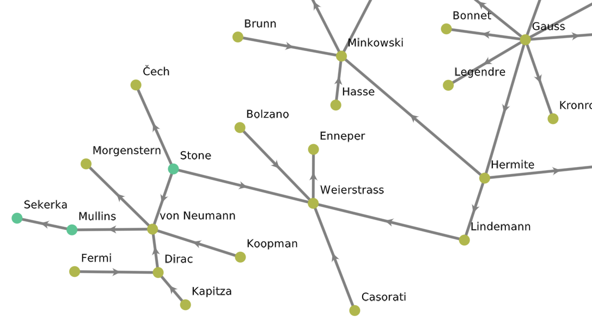

# Nodariety.jl

Nodariety is a fun (I hope) exploration of the directed graph of concept/theory/algorithm/model/etc. names, where nodes are names of people and edges are "hyphens" between them. Here's a little excerpt: 


For more of the story behind this package and some example analyses, see the blog post [here](link_coming_soon).

## What do you get?
If you were to install the package (`]add Nodariety`) and import it (`using Nodariety`), what could you then do?

The package exports the `HyphenGraph` type, as well as a default instance of it called `hg`, which has all the data described by the two CSV files in the `data/` folder of this repo.

Because `HyphenGraph` is a subtype of `AbstractGraph`, a lot of the graph analysis algorithms in `LightGraph` "just work" on it! The package has a variety of functions to play around with this. They all use `hg` as the default argument, so you can call them straight-up. For example, suppose we wanted to find the longest path we can traverse:

```julia
julia> paths = longest_path()
2-element Vector{Vector{Int64}}:
 [183, 391, 82, 40, 75, 248, 282, 368]
 [285, 391, 82, 40, 75, 248, 282, 368]

 julia> subgraph = hg[paths[2]]
 HyphenGraph with 8 people, 7 hyphens

 julia> subgraph.node_info.family_name
 8-element Vector{String}:
 "Navier"
 "Stokes"
 "Einstein"
 "Cartan"
 "Dieudonné"
 "Manin"
 "Mumford"
 "Shah"
```

Or maybe we want to play around with centrality measures (note that eigenvector centrality can return different results different times it's called):
```julia
julia> all_centrals()
betweenness_centrality: Albert Einstein
closeness_centrality: Leonhard Euler
degree_centrality: Albert Einstein
eigenvector_centrality: Claude-Louis Navier
katz_centrality: David Mumford
pagerank: Albert Einstein
stress_centrality: Albert Einstein
radiality_centrality: Niels Abel
```


## I want to contribute!